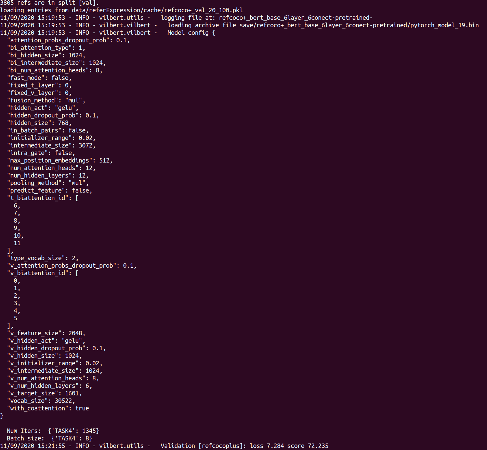

# Natural-Language-Processing
This is the readme for phase1 submission. Project topic: Robot Scene Understanding using Referring Relationship

Model:

## 1. Vil-Bert model
   model address: https://github.com/jiasenlu/vilbert_beta
   - **Xiao & Ziming**:
   * We used a conda env for installing the vil-Bert model and pytorch with other deeplearning packages:
```
conda create -n vilbert python=3.6
conda activate vilbert
git clone https://github.com/jiasenlu/vilbert_beta
cd vilbert_beta
pip install -r requirements.txt
conda install pytorch torchvision cudatoolkit=10.0 -c pytorch
cd tools/refer
make
```
* For using a pretrained model with 6-Layer vil-Bert, simply go to https://drive.google.com/drive/folders/1GWY2fEbZCYHkcnxd0oysU0olfPdzcD3l and save the downloaded model under `~/vilbert_beta/save`. 
* For using refercoco dataset, download from the dropbox: https://www.dropbox.com/sh/4jqadcfkai68yoe/AADHI6dKviFcraeCMdjiaDENa?dl=0 and move the unzipped file `referExpression` folder to `~/vilbert_beta/data`. The default pytorch dataloader is used to load the Downstream tasks, raw data need to be converted to the `tsv` file to `lmdb`. 
* Since re-training model on refercoco+ took too much time, we simply did a validation on a split refercoco+ dataset, `3085` images are used for validation. Here is the command:
```
python eval_tasks.py --bert_model bert-base-uncased --from_pretrained save/refcoco+_bert_base_6layer_6conect-pretrained/pytorch_model_19.bin --config_file config/bert_base_6layer_6conect.json --task 4
```
The script resulted in the loss and validation score.



## 2. VL-Bert model
   model address: https://github.com/jackroos/VL-BERT
   - **Alex & Zijie**: 
